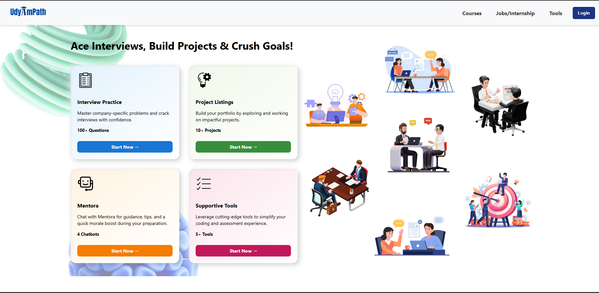
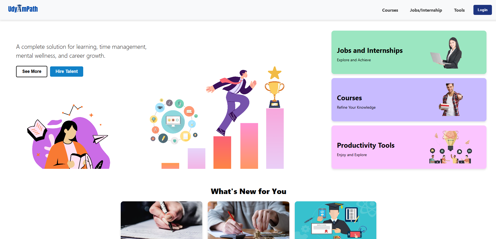
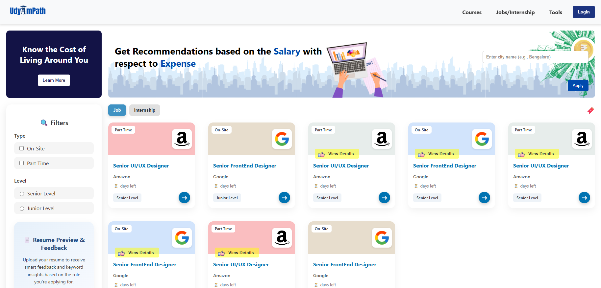
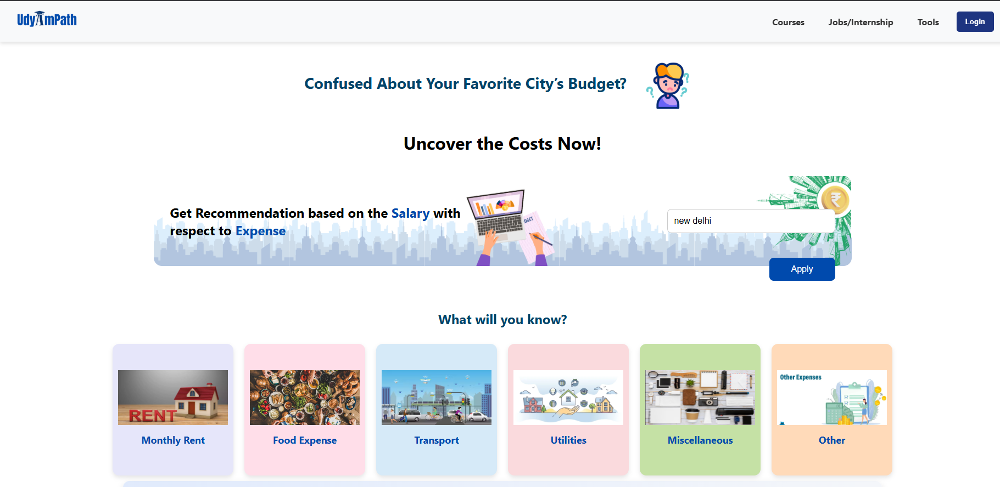
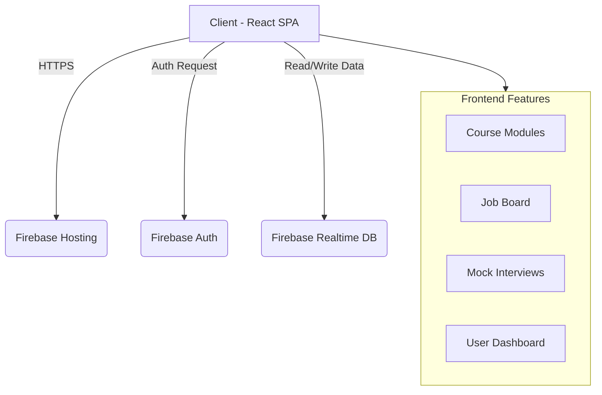
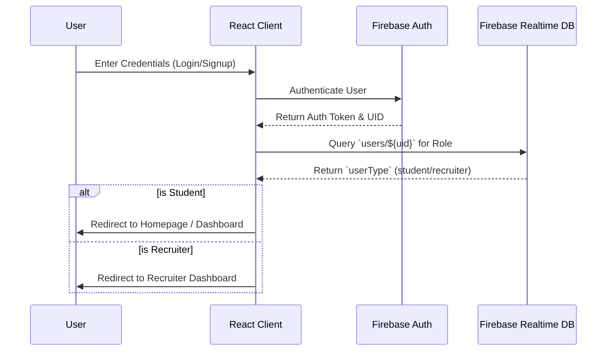
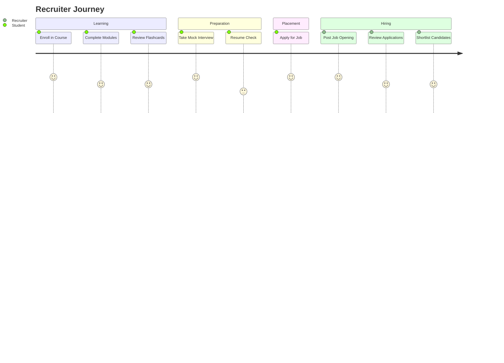

# UdyAmPath 🚀 

<div align="center">
  
</div>
<br />

<p align="center">
  <i>
    ✨ <b>UdyAmPath</b> is the definitive AI-powered career ecosystem, intelligently engineered to seamlessly bridge the gap between ambitious students, dedicated educators, and visionary recruiters. ✨
  </i>
</p>

<br />
---

## 📖 Table of Contents
1. [Project Overview](#-project-overview)
2. [Key Features](#-key-features)
3. [Technology Stack](#-technology-stack)
4. [Architecture](#-architecture)
5. [Prerequisites](#-prerequisites)
6. [Installation and Setup](#-installation-and-setup)
7. [Environment Variables](#-environment-variables)
8. [Available Scripts](#-available-scripts)
9. [Project Structure](#-project-structure)
10. [Core Components](#-core-components)
11. [Pages Deep Dive](#-pages-deep-dive)
12. [Authentication Flow](#-authentication-flow)
13. [Roles & Permissions](#-roles--permissions)
14. [Design System & Styling](#-design-system--styling)
15. [Deployment](#-deployment)
16. [Future Enhancements](#-future-enhancements)
17. [Contribution Guidelines](#-contribution-guidelines)
18. [Collaborators & Team](#-collaborators--team)
19. [License](#-license)
20. [Contact & Support](#-contact--support)

---

## 🌟 Project Overview
**UdyAmPath** is a comprehensive educational and career advancement platform built specifically for university students and job seekers. It offers personalized learning pathways, mock interviews, placement preparation tools, and a direct portal for recruiters to find top talent. The platform features an AI-powered job simulator, an integrated learning management system, and comprehensive tracking of user progress and achievements.

### Mission
To empower students with the right skills, resources, and connections to land their dream jobs, while providing recruiters with a streamlined hiring process.

---

## ✨ Key Features

### 1. 📚 Course Management & Learning Pathways
- **Interactive Modules**: Step-by-step learning modules with rich text, video, and interactive content.
- **My Learnings Dashboard**: A dedicated dashboard for users to track their enrolled courses, progress percentages, and last accessed dates.
- **Specializations & Pathways**: Curated learning tracks for different career goals (e.g., Frontend Developer, Data Scientist).



### 2. 💼 Job & Internship Portal
- **Job Listings**: Real-time updates on available jobs and internships.
- **One-Click Apply**: Seamless application process directly from the platform.
- **Job Simulator**: An innovative feature allowing users to simulate day-to-day tasks of specific job roles.
- **Resume Checker**: Automated resume analysis to ensure candidates meet industry standards.



### 3. 🛠️ Placement Preparation Tools
- **Mock Interviews (Tech & HR)**: Practice interviews with AI-generated feedback.
- **Group Discussion Rooms**: Virtual spaces for candidates to practice GD skills.
- **Placement Papers & Pyqs**: A vast repository of previous year questions and placement papers from top companies.
- **Adaptability & Communication Tests**: Assess and improve soft skills essential for modern workplaces.



### 4. 📝 Notes & Flashcards
- **Digital Library**: Access to e-books, notes, and study materials.
- **Flashcards**: Interactive flashcards for quick revision of important concepts.

### 5. 👥 Role-Based Access Control
- **Student Portal**: Focused on learning, preparation, and job application.
- **Recruiter Portal**: Dedicated interface for HR professionals to post jobs, review applications, and contact candidates.

---

## 💻 Technology Stack

**Frontend:**
- **React.js (v19)**: The core library for building the user interface.
- **React Router (v6)**: For seamless client-side routing.
- **Framer Motion**: For fluid animations and page transitions.
- **Styled Components**: For component-level styling.
- **React Icons / FontAwesome**: For iconography.
- **Monaco Editor**: Integrated code editor for technical tests.

**Backend & Services:**
- **Firebase Authentication**: For secure user login (Email/Password, Google).
- **Firebase Realtime Database**: For storing user profiles, course progress, and application data.
- **Firebase Hosting**: For fast and secure deployment.

**Machine Learning & AI:**
- **TensorFlow.js**: For running in-browser ML models.
- **Face-api.js**: For facial recognition during mock interviews/tests.

**Utilities:**
- **DOMPurify**: For sanitizing HTML content.
- **PDF-lib / React-pdf-viewer**: For handling and displaying PDF documents.

---

## 🏗️ Architecture



---

## 📋 Prerequisites

Before you begin, ensure you have the following installed:
- **Node.js**: v16.0.0 or higher
- **npm**: v8.0.0 or higher
- **Git**: v2.0.0 or higher
- A modern web browser (Chrome, Firefox, Safari, Edge)

---

## 🚀 Installation and Setup

1. **Clone the repository:**
   ```bash
   git clone https://github.com/Komalgiri/Udyampath.ai.git
   cd UdyAmPath
   ```

2. **Install dependencies:**
   ```bash
   npm install
   # or
   yarn install
   ```

3. **Configure Firebase:**
   - Create a new project on [Firebase Console](https://console.firebase.google.com/).
   - Enable Authentication (Email/Password & Google).
   - Enable Realtime Database.
   - Get your Firebase config object and set up environment variables (see below).

---

## 🔐 Environment Variables

Create a `.env` file in the root directory and add your Firebase configuration:

```env
REACT_APP_FIREBASE_API_KEY=your_api_key
REACT_APP_FIREBASE_AUTH_DOMAIN=your_auth_domain
REACT_APP_FIREBASE_DATABASE_URL=your_database_url
REACT_APP_FIREBASE_PROJECT_ID=your_project_id
REACT_APP_FIREBASE_STORAGE_BUCKET=your_storage_bucket
REACT_APP_FIREBASE_MESSAGING_SENDER_ID=your_messaging_sender_id
REACT_APP_FIREBASE_APP_ID=your_app_id
```

---

## 📜 Available Scripts

In the project directory, you can run:

### `npm start` or `npm run dev`
Runs the app in development mode. Open [http://localhost:3000](http://localhost:3000) to view it in your browser. The page will reload when you make changes.

### `npm run build`
Builds the app for production to the `build` folder. It correctly bundles React in production mode and optimizes the build for the best performance.

### `npm test`
Launches the test runner in interactive watch mode.

### `npm run eject`
**Note: this is a one-way operation. Once you `eject`, you can't go back!**
Copies all configuration files (webpack, Babel, ESLint) directly into your project.

---

## 📁 Project Structure

```
UdyAmPath/
├── public/               # Static assets
├── src/
│   ├── assets/           # Images, icons, fonts
│   ├── components/       # Reusable UI components
│   │   ├── coursepage/   # Components related to courses (MyLearningsPage, etc.)
│   │   ├── homepage/     # Homepage specific components
│   │   ├── jobpage/      # Job board and application components
│   │   ├── shared/       # Generic components (Buttons, Modals, Cards)
│   │   └── toolspage/    # Preparation tools (Mock tests, Resume builder)
│   ├── firebase/         # Firebase initialization and config
│   ├── pages/            # Top-level route components (Views)
│   │   ├── coursedetail.jsx
│   │   ├── coursepage.jsx
│   │   ├── homepage.jsx
│   │   ├── jobpage.jsx
│   │   ├── login.jsx
│   │   ├── signup.jsx
│   │   └── ...
│   ├── App.js            # Main application component & Router setup
│   ├── index.js          # Entry point
│   ├── index.css         # Global styles
│   └── setupTests.js     # Test configuration
├── .gitignore            # Git ignore file
├── package.json          # Project metadata and dependencies
└── README.md             # Project documentation (You are here)
```

---

## 🧩 Core Components

### `MyLearningsPage`
Located in `src/components/coursepage/`. This component provides users with a visual dashboard of their enrolled courses. It uses Framer Motion for entrance animations and interactive hover states. Progress is tracked via an intuitive progress bar, and data is synced locally/remitely.

### `GlassCard` & `AnimatedSection`
Shared UI components that enforce the platform's signature "glassmorphism" aesthetic. They ensure visual consistency across all pages while providing smooth entry animations.

### `JobSimulator`
An interactive component where users can experience a day in the life of specific roles. It utilizes state management to progress through different scenarios and tasks.

---

## 🧭 Pages Deep Dive

### **Homepage (`/homepage`)**
The landing page featuring hero sections, value propositions, and calls to action. It uses responsive design to ensure a seamless experience on mobile, tablet, and desktop.

### **Course Page (`/coursepage`)**
The hub for all educational content. Users can browse available courses, view pathways, and access their specific learning modules.

### **Jobs Page (`/jobpage`)**
Features a dynamic list of job openings. Includes filtering options, detailed job descriptions, and integrated application forms.

### **Tools Page (`/toolspage`)**
A dedicated section for placement preparation. Contains links to mock interviews, resume checkers, and technical tests.

### **Recruiter Dashboard (`/recruiter`)**
A specialized view accessible only to users with the 'recruiter' role. Allows for managing job postings and reviewing applicant profiles.

---

## 🔐 Authentication Flow

1. **Sign Up/Log In**: Users access the `AuthModal` (via `/login` or `/signup`).
2. **Firebase Auth**: Credentials are verified against Firebase Authentication.
3. **Role Check**: Upon successful login, the app queries the Firebase Realtime Database (`users/${uid}`) to determine the user's role (student vs. recruiter).
4. **Redirection**: 
   - Students are directed to the Homepage/Dashboard.
   - Recruiters are directed to the Recruiter Dashboard via the `RecruiterRoute` component.



---

## 🛡️ Roles & Permissions

The application uses custom wrapper components for route protection in `App.js`:

- **`ProtectedRoute`**: Ensures the user is logged in. Unauthenticated users are redirected to the homepage.
- **`RecruiterRoute`**: Ensures the user is logged in AND has the `userType` of 'recruiter'. Protects sensitive hiring tools.

### User Journey (Student vs. Recruiter)


---

## 🎨 Design System & Styling

UdyAmPath employs a modern, clean aesthetic:
- **Glassmorphism**: Extensive use of semi-transparent backgrounds with blur effects to create a layered, modern look.
- **Color Palette**: Defined in `index.css` as CSS variables (e.g., `--course-primary`, `--text-primary`) for easy theming and consistency.
- **Responsive Design**: Heavy utilization of `react-responsive` media queries and CSS Grid/Flexbox to adapt to all screen sizes.
- **Animations**: Strategic use of Framer Motion for micro-interactions (hover states, modal pops, page transitions) to enhance user experience without being overwhelming.

---

## 🌐 Deployment

The application is optimized for deployment on Firebase Hosting or Vercel.

**For Firebase Hosting:**
1. Install Firebase CLI: `npm install -g firebase-tools`
2. Login: `firebase login`
3. Initialize: `firebase init hosting`
4. Build: `npm run build`
5. Deploy: `firebase deploy --only hosting`

---

## 🔮 Future Enhancements
- Integration of WebRTC for live 1-on-1 mentorship sessions.
- Advanced AI resume parsing and personalized improvement suggestions.
- Peer-to-peer code review system for technical courses.
- Gamification elements (badges, leaderboards) to increase user engagement.

---

## 🤝 Contribution Guidelines

We welcome contributions to UdyAmPath! Please follow these steps:

1. Fork the repository.
2. Create a new branch: `git checkout -b feature/your-feature-name`
3. Make your changes and commit them: `git commit -m "Add some feature"`
4. Push to the branch: `git push origin feature/your-feature-name`
5. Submit a pull request detailing your changes.

Please ensure your code adheres to the existing ESLint configuration and includes appropriate comments.

---

## 👥 Collaborators & Team

- **Komal Giri** - Project Lead & Developer (Equally Contributed)
- **Ankit Kumar [@princliv](https://github.com/princliv)** - Project Lead & Developer (Equally Contributed)

We both are equally dedicated to this project and actively developing it. We are also looking for more open-source contributors to help build the future of education and placement!

---

## 📄 License

This project is licensed under the MIT License - see the [LICENSE.md](LICENSE.md) file for details.

---

## 📞 Contact & Support

For support, inquiries, or feedback, please reach out via the repository's issue tracker or contact the maintainers directly through GitHub.

---
*Built with ❤️ for the student community.*
